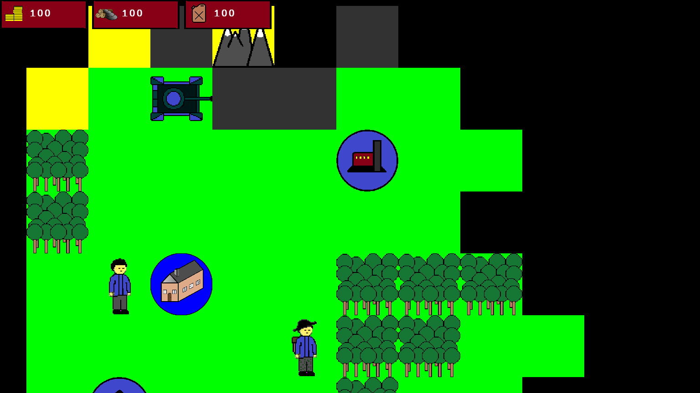
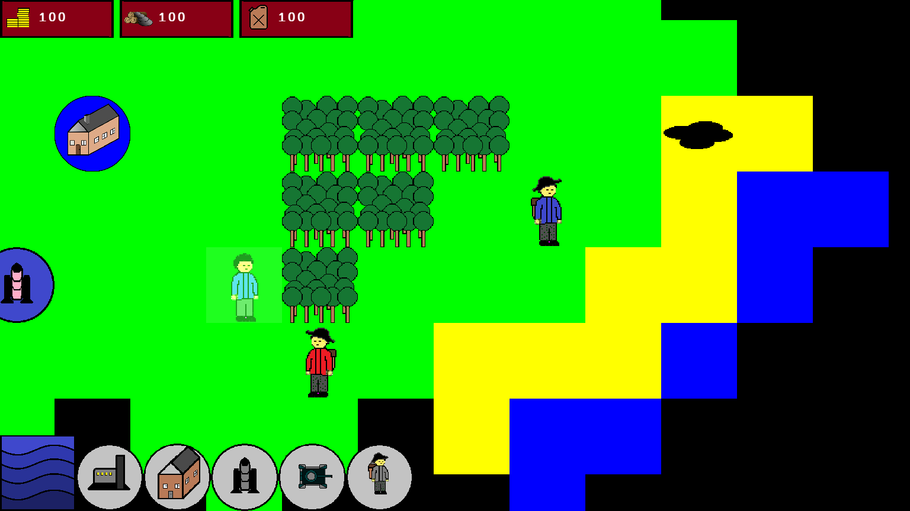

# RAB_RTS_2
## Here is my first big C++ project. 

RTS here means "Road to Space", besides it is turn-based strategy (remake of my old project).
RAB stands for "Red and Blue" - my series of games.

### Project's goal is me to study C++ and game development. 
### Graphics and some other stuff use SDL and its libraries. Here I also used FreeMono font.
### Textures are my own samples, so I'm going to replace it someday.

### To build the project I used Visual Studio 2019. 
### Additional dependencies are SDL, SDL_image and SDL_ttf.

# Here are two screenshots. 

